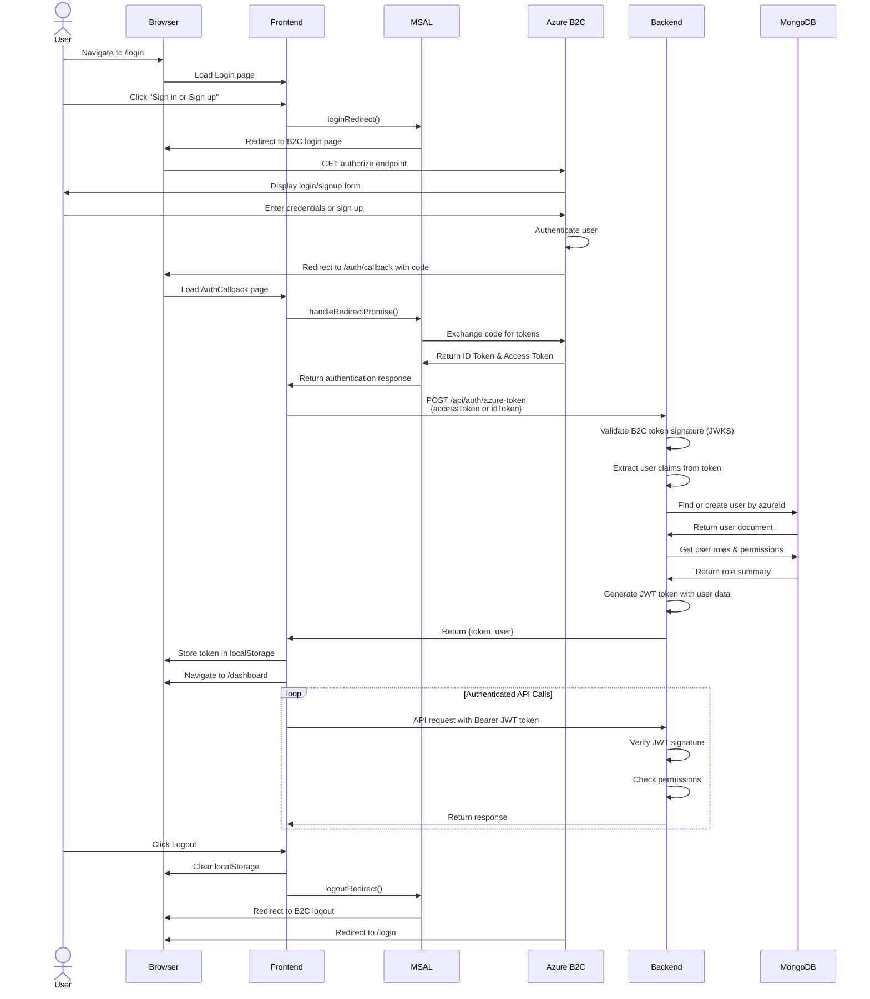

# Azure B2C Authentication Flow

This document details how the Linker application uses Azure Active Directory B2C (Azure AD B2C) to authenticate users and manage authorization.

## Overview

The authentication system uses Azure AD B2C as the identity provider, with the frontend handling the authentication flow via MSAL (Microsoft Authentication Library) and the backend validating B2C tokens and issuing its own JWT tokens for API access.

## Authentication Flow



## Token Types and Usage

### 1. B2C ID Token (from Azure B2C)
- **Issued by**: Azure AD B2C
- **Format**: JWT (JSON Web Token)
- **Purpose**: Contains user identity claims from B2C
- **Lifespan**: Typically 1 hour (configurable in B2C)
- **Contains**:
  - `sub` or `oid`: Unique Azure user identifier
  - `emails`: User email addresses array
  - `name`: User's display name
  - `given_name`: User's first name
  - `family_name`: User's last name
  - `iss`: Token issuer (B2C authority URL)
  - `aud`: Audience (Azure Client ID)
  - `exp`: Expiration timestamp
  - `iat`: Issued at timestamp

**Usage**: The frontend receives this from B2C after successful authentication and sends it to the backend **one time only** for initial validation. After that, it is **not used again**.

### 2. B2C Access Token (from Azure B2C)
- **Issued by**: Azure AD B2C
- **Purpose**: Can be used to access B2C-protected resources
- **Note**: In B2C flows, the ID token is typically used for authentication. This application uses the ID token.

### 3. B2C Refresh Token (from Azure B2C)
- **Issued by**: Azure AD B2C (when `offline_access` scope is requested)
- **Purpose**: Could be used to obtain new B2C tokens without re-authentication
- **Current Implementation**: **NOT USED** - The application requests the `offline_access` scope during login, but does not store or use the refresh token
- **Why not used**: The backend-generated JWT (see below) has a 7-day lifespan, which is sufficient for the application's needs

### 4. Backend JWT Token (from Linker Backend)
- **Issued by**: Linker Backend API
- **Format**: JWT signed with `JWT_SECRET`
- **Purpose**: **Primary authorization token** for all API access after initial login
- **Lifespan**: 7 days (configurable via `JWT_EXPIRES_IN`)
- **Storage**: Browser localStorage (key: `authToken`)
- **Contains**:
  - `userId`: MongoDB user document ID
  - `azureId`: Azure B2C user identifier
  - `email`: User's email address
  - `name`: User's full name
  - `firstName`, `lastName`: User name components
  - `role`: Legacy role field (for backward compatibility)
  - `roles`: Array of role names (e.g., `["USER", "ADMIN"]`)
  - `permissions`: Array of permission objects with `resource` and `actions`
  - `preferences`: User preferences (theme, timezone, etc.)
  - `exp`: Expiration timestamp
  - `iat`: Issued at timestamp

**Usage**: This is the **ONLY** token used for authenticated API requests. It is sent as `Authorization: Bearer <token>` header with every API request.

## Token Lifecycle Summary

**Initial Login:**
1. B2C ID Token received from Azure B2C → Sent to backend once → Discarded
2. Backend JWT generated → Stored in localStorage → Used for all subsequent requests

**During Session:**
- Only the backend JWT is used
- No token refresh mechanism is implemented
- B2C tokens are not stored or reused

**Token Expiration:**
- Backend JWT expires after 7 days
- User must login again to get a new backend JWT
- No automatic token refresh from B2C

**Why This Approach:**
- Simplified token management (one token to track)
- Backend has full control over sessions and permissions
- 7-day expiration balances security and user convenience
- No need to manage B2C refresh token complexity

## Frontend Configuration

### Required Environment Variables

Located in `frontend/.env`:

```bash
# API Configuration
REACT_APP_API_BASE_URL=http://localhost:5001/api

# Azure B2C Configuration
REACT_APP_AZURE_CLIENT_ID=<your-b2c-client-id>
REACT_APP_B2C_TENANT_NAME=<your-tenant-name>
REACT_APP_B2C_USER_FLOW_NAME=B2C_1_signupsignin
REACT_APP_AZURE_REDIRECT_URI=http://localhost:3000/auth/callback
REACT_APP_LOGOUT_REDIRECT_URI=http://localhost:3000/login
```

### Configuration Details

#### `REACT_APP_AZURE_CLIENT_ID`
- **Purpose**: Identifies the frontend application to Azure B2C
- **Where to get**: Azure Portal > B2C Directory > App registrations > Your app > Application (client) ID
- **Why it's important**: B2C uses this to validate the redirect URI and determine which app is requesting authentication

#### `REACT_APP_B2C_TENANT_NAME`
- **Purpose**: Specifies your B2C tenant subdomain
- **Format**: Just the tenant name without `.onmicrosoft.com` or `.b2clogin.com`
- **Example**: If your tenant is `contoso.onmicrosoft.com`, use `contoso`
- **Why it's important**: Constructs the B2C authority URL for authentication

#### `REACT_APP_B2C_USER_FLOW_NAME`
- **Purpose**: Specifies which B2C user flow to use for authentication
- **Common value**: `B2C_1_signupsignin` (combined sign-up/sign-in flow)
- **Other options**: `B2C_1_signup`, `B2C_1_signin`, `B2C_1_reset_password`
- **Why it's important**: Determines the authentication experience users see

#### `REACT_APP_AZURE_REDIRECT_URI`
- **Purpose**: URL where B2C redirects after authentication
- **Must match**: The redirect URI configured in Azure B2C app registration
- **Typical value**: `{FRONTEND_URL}/auth/callback`
- **Why it's important**: Security measure to prevent token theft

#### `REACT_APP_LOGOUT_REDIRECT_URI`
- **Purpose**: URL where B2C redirects after logout
- **Typical value**: `{FRONTEND_URL}/login`
- **Why it's important**: Provides smooth user experience after logout

### MSAL Configuration (in App.js)

```javascript
const msalConfig = {
  auth: {
    clientId: process.env.REACT_APP_AZURE_CLIENT_ID,
    authority: `https://${B2C_TENANT_NAME}.b2clogin.com/${B2C_TENANT_NAME}.onmicrosoft.com/${USER_FLOW}`,
    knownAuthorities: [`${B2C_TENANT_NAME}.b2clogin.com`],
    redirectUri: process.env.REACT_APP_AZURE_REDIRECT_URI,
    postLogoutRedirectUri: process.env.REACT_APP_LOGOUT_REDIRECT_URI,
    navigateToLoginRequestUrl: false
  },
  cache: {
    cacheLocation: 'sessionStorage',
    storeAuthStateInCookie: false
  }
};
```

**Key Configuration Options:**
- **`cacheLocation: 'sessionStorage'`**: Tokens are stored in session storage (cleared when browser closes)
- **`storeAuthStateInCookie: false`**: Auth state is not stored in cookies (recommended for SPAs)
- **`navigateToLoginRequestUrl: false`**: After login, don't navigate to the originally requested URL

### Frontend Authentication Components

#### 1. **Login.js** (`/pages/Login.js`)
- Displays the login page
- Triggers B2C authentication flow
- Uses `useAuth().login()` to initiate redirect to B2C

#### 2. **AuthCallback.js** (`/components/AuthCallback.js`)
- Handles the redirect from B2C after authentication
- Calls `instance.handleRedirectPromise()` to process the redirect
- Extracts the token (ID token or access token)
- Sends token to backend for validation via `authAPI.validateToken()`
- Redirects to dashboard on success

#### 3. **ProtectedRoute.js** (`/components/ProtectedRoute.js`)
- Wraps protected routes to enforce authentication
- Checks `isAuthenticated` from `useAuth()`
- Redirects to `/login` if not authenticated
- Shows loading spinner during auth state check

#### 4. **useAuth Hook** (`/hooks/useAuth.js`)
- Central authentication state management
- Provides authentication context to entire app
- Key functions:
  - `login()`: Initiates B2C login flow
  - `logout()`: Clears local state and initiates B2C logout
  - `validateTokenWithBackend()`: Validates B2C token with backend
  - `checkAuthStatus()`: Verifies current auth state on app load
- Manages localStorage for auth token and user info

#### 5. **API Utilities** (`/utils/api.js`)
- Axios instance with interceptors
- **Request Interceptor**: Adds `Authorization: Bearer <token>` header to all requests
- **Response Interceptor**: Handles 401 errors by clearing auth state and redirecting to login

## Backend Configuration

### Required Environment Variables

Located in `backend/.env`:

```bash
# Azure B2C Configuration
AZURE_CLIENT_ID=<your-b2c-client-id>
AZURE_CLIENT_SECRET=<your-b2c-client-secret>
AZURE_B2C_TENANT_NAME=<your-tenant-name>
AZURE_B2C_USER_FLOW=B2C_1_signupsignin
AZURE_TENANT_ID=<your-azure-tenant-id>

# JWT Configuration
JWT_SECRET=<your-secret-key>
JWT_EXPIRES_IN=7d

# Application URLs
FRONTEND_URL=http://localhost:3000
```

### Configuration Details

#### `AZURE_CLIENT_ID`
- **Purpose**: Identifies the backend application to Azure B2C
- **Must match**: The client ID configured in Azure B2C app registration
- **Why it's important**: Used to validate the audience (`aud`) claim in B2C tokens

#### `AZURE_CLIENT_SECRET`
- **Purpose**: Client secret for confidential client flows (not used in SPA flow)
- **Where to get**: Azure Portal > B2C Directory > App registrations > Certificates & secrets
- **Why it's important**: Required for MSAL Node initialization

#### `AZURE_B2C_TENANT_NAME`
- **Purpose**: Same as frontend, identifies the B2C tenant
- **Must match**: Frontend configuration
- **Why it's important**: Constructs JWKS URI for token validation

#### `AZURE_B2C_USER_FLOW`
- **Purpose**: Identifies which user flow was used for authentication
- **Must match**: Frontend configuration
- **Why it's important**: Used to construct expected token issuer URL

#### `AZURE_TENANT_ID`
- **Purpose**: The Azure tenant ID (GUID)
- **Where to get**: Azure Portal > B2C Directory > Overview > Tenant ID
- **Why it's important**: Alternative issuer format for B2C tokens

#### `JWT_SECRET`
- **Purpose**: Secret key used to sign backend JWT tokens
- **Security**: Must be strong, random, and kept secret
- **Why it's important**: Prevents token forgery; compromise means all tokens are vulnerable

#### `JWT_EXPIRES_IN`
- **Purpose**: Token expiration time
- **Format**: String like `7d` (7 days), `24h` (24 hours), `60s` (60 seconds)
- **Why it's important**: Balances security and user experience

### Backend Authentication Services

#### 1. **AuthService** (`/services/AuthService.ts`)
Main authentication service with key methods:

- **`validateAzureToken(token)`**: Validates B2C/Azure AD tokens
  - Decodes the JWT header to get the key ID (`kid`)
  - Fetches the public key from JWKS endpoint
  - Verifies token signature using RS256 algorithm
  - Validates issuer, audience, and expiration
  - Extracts user claims (sub, emails, name, etc.)

- **`validateB2CToken(token)`**: B2C-specific validation
  - Constructs JWKS URI: `https://{tenant}.b2clogin.com/{tenant}.onmicrosoft.com/{userflow}/discovery/v2.0/keys`
  - Accepts multiple issuer formats (tenant name or tenant ID)
  - Extracts B2C-specific claims (emails array, given_name, family_name)

- **`authenticateUser(azureUserInfo)`**: Creates/updates user and generates JWT
  - Finds existing user by `azureId` or creates new user
  - Initializes default roles for new users
  - Gets user's roles and permissions from RoleService
  - Generates backend JWT token with user data and permissions
  - Returns token and user object

#### 2. **Auth Routes** (`/routes/auth.ts`)

**`POST /api/auth/azure-token`**
- Receives B2C token from frontend
- Validates token signature and claims
- Creates/updates user in database
- Assigns roles and permissions
- Returns backend JWT token and user data

**`GET /api/auth/me`**
- Requires valid JWT token (via `authMiddleware`)
- Returns current user profile with roles and permissions
- Used by frontend to verify authentication state

**`PATCH /api/auth/preferences`**
- Updates user preferences (theme, timezone)
- Requires valid JWT token
- Returns updated user object

**`POST /api/auth/logout`**
- Endpoint for logout (token invalidation happens on frontend)
- Returns success message

#### 3. **Auth Middleware** (`/middleware/auth.ts`)

Applied to all protected routes:
- Extracts JWT token from `Authorization: Bearer <token>` header
- Verifies token signature using `JWT_SECRET`
- Validates token expiration
- Attaches decoded user data to `req.user`
- Returns 401 errors for invalid/expired tokens

### Token Validation Process

1. **Frontend receives B2C token** (ID token or access token)
2. **Frontend sends token to backend** via `POST /api/auth/azure-token`
3. **Backend decodes token header** to get key ID (`kid`)
4. **Backend fetches public key** from B2C JWKS endpoint
5. **Backend verifies signature** using RS256 algorithm
6. **Backend validates claims**:
   - `iss` (issuer) matches expected B2C authority
   - `aud` (audience) matches `AZURE_CLIENT_ID`
   - `exp` (expiration) is in the future
7. **Backend extracts user info** from verified token
8. **Backend creates/updates user** in MongoDB
9. **Backend generates JWT token** signed with `JWT_SECRET`
10. **Backend returns JWT token** to frontend

## Data Flow

### User Login Flow
1. User visits login button → Frontend calls `login()`
2. MSAL redirects to B2C login page
3. User authenticates with B2C
4. B2C redirects to `/auth/callback` with authorization code
5. MSAL exchanges code for tokens (ID token, access token, and refresh token with `offline_access` scope)
6. Frontend sends **B2C ID token** to backend (one-time use)
7. Backend validates B2C token signature and creates/updates user
8. Backend returns **backend JWT token** (7-day expiration)
9. Frontend stores **backend JWT** in localStorage as `authToken`
10. Frontend stores user info in localStorage as `userInfo`
11. Frontend redirects to dashboard
12. **B2C tokens are discarded** - not stored or used again

### Authenticated API Request Flow
1. Frontend needs to make API request
2. Axios interceptor adds **backend JWT token** to `Authorization: Bearer <token>` header
3. Backend auth middleware verifies **backend JWT** signature using `JWT_SECRET`
4. Backend checks user permissions from JWT payload
5. Backend processes request
6. Backend returns response
7. Frontend receives and processes response

### App Reload / Page Refresh Flow
1. User reloads page or returns to app
2. Frontend checks localStorage for `authToken`
3. If token exists, frontend calls `GET /api/auth/me` with token
4. Backend validates **backend JWT** (not B2C token)
5. Backend returns current user profile
6. Frontend updates auth state
7. User remains logged in (no B2C interaction needed)

### Token Expiration Flow
1. Backend JWT expires after 7 days
2. Next API request returns 401 Unauthorized
3. Axios response interceptor catches 401 error
4. Frontend clears localStorage
5. Frontend redirects to `/login`
6. User must authenticate with B2C again to get new tokens

### User Logout Flow
1. User visits logout button
2. Frontend clears localStorage (`authToken`, `userInfo`)
3. Frontend calls MSAL `logoutRedirect()`
4. Browser redirects to B2C logout endpoint
5. B2C clears B2C session cookies
6. B2C redirects to `/login`
7. User must re-authenticate to access the app again

## Permission System

The backend uses a role-based access control (RBAC) system:

### Roles
- **USER**: Standard user with read access
- **ADMIN**: Full administrative access
- **MANAGER**: Management permissions

### Permissions Structure
```javascript
{
  resource: 'urls',
  actions: ['read', 'write', 'delete']
}
```

### Common Permission Checks
- `hasRole('ADMIN')`: Check if user has specific role
- `hasPermission('urls', 'write')`: Check if user can perform action on resource
- `canManageUrls()`: Helper for URL management permission
- `canViewAnalytics()`: Helper for analytics access

These permissions are included in the backend JWT token and available in the frontend via `useAuth()` hook.

## Security Considerations

1. **Token Storage**: JWT tokens stored in localStorage (vulnerable to XSS)
2. **HTTPS Required**: All production traffic must use HTTPS
3. **Token Expiration**: Backend JWT expires after 7 days; users must re-authenticate
4. **No Token Refresh**: Application does not implement automatic token refresh
5. **B2C Token Validation**: Backend verifies token signature using public keys from JWKS
6. **CORS Configuration**: Backend should whitelist frontend URL
7. **Redirect URI Validation**: B2C validates redirect URIs to prevent token theft
8. **State Parameter**: MSAL uses state parameter to prevent CSRF attacks

### Token Strategy: Why No Refresh Mechanism?

**Current Implementation:**
- B2C ID token → Used once for initial authentication → Discarded
- Backend JWT → Stored in localStorage → Valid for 7 days → No refresh

**Reasons for This Approach:**
1. **Simplicity**: Single token to manage (backend JWT) instead of coordinating B2C refresh tokens
2. **Backend Control**: Backend has complete control over session lifecycle and permissions
3. **Security**: Shorter token lifespans are more secure; 7 days balances security and UX
4. **Stateless**: No need to track refresh tokens or maintain refresh token database
5. **Clear Expiration**: Users know they need to re-authenticate every 7 days

**Trade-offs:**
- **Pro**: Simpler architecture, easier to debug, backend owns authorization
- **Pro**: No risk of refresh token theft or misuse
- **Pro**: Backend can revoke access by not issuing new tokens on re-authentication
- **Con**: Users must re-authenticate every 7 days (even if actively using the app)
- **Con**: No "remember me" or extended session capability

**Alternative Approach (Not Implemented):**
To implement automatic token refresh, you would need to:
1. Store B2C refresh token securely (httpOnly cookie recommended over localStorage)
2. Monitor backend JWT expiration on the frontend
3. Call backend endpoint to refresh JWT before expiration
4. Backend uses B2C refresh token to get new B2C tokens
5. Backend validates new B2C token and issues new backend JWT

This adds complexity but allows users to stay logged in indefinitely (or until B2C refresh token expires, typically 90 days).

## Troubleshooting

### Common Issues

**Issue**: "Invalid token format" error
- **Cause**: B2C returning unexpected token format
- **Solution**: Check that B2C app registration includes ID token configuration

**Issue**: "Token validation failed" error
- **Cause**: Issuer or audience mismatch
- **Solution**: Verify `AZURE_CLIENT_ID` matches in both frontend and backend

**Issue**: "No token received from B2C redirect"
- **Cause**: Redirect URI mismatch or B2C configuration error
- **Solution**: Ensure redirect URI in `.env` matches Azure B2C app registration

**Issue**: 401 errors on API calls
- **Cause**: Missing or expired JWT token
- **Solution**: Check localStorage for `authToken`, verify token hasn't expired

**Issue**: User redirected to login after successful authentication
- **Cause**: Backend validation failing or token not stored properly
- **Solution**: Check browser console and network tab for errors during token validation

## Configuration

### Cache Configuration Defaults
- **MSAL Cache Location**: `'sessionStorage'`
  - **Review**: Tokens cleared when browser closes; use `'localStorage'` for persistence
  - **Security Trade-off**: sessionStorage is more secure but less convenient
  
- **Store Auth State in Cookie**: `false`
  - **Review**: Recommended setting for SPAs; set to `true` if IE11 support needed

### Missing Configuration Warnings
If the following are not set, the application will fail to start or authentication will fail:
- `REACT_APP_AZURE_CLIENT_ID`
- `REACT_APP_B2C_TENANT_NAME`
- `AZURE_CLIENT_ID` (backend)
- `AZURE_CLIENT_SECRET` (backend)
- `JWT_SECRET` (backend)
- `AZURE_B2C_TENANT_NAME` (backend)
- `AZURE_B2C_USER_FLOW` (backend)

Always verify these are properly configured before deploying to production.
